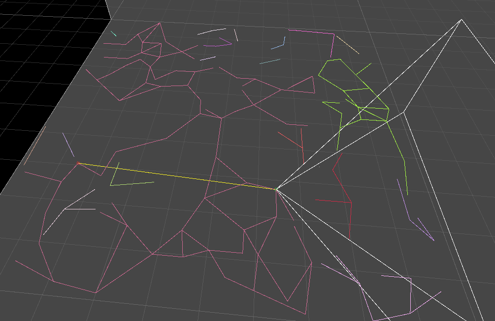

# Procedural_Tunnel_Creation_Demo
#### Game jam game, where you can see one way of generating tunnels with mesh. 
#### Game generates mesh acording to the map, mesh is split in pathways, corridors and tunnel ends. Uvs and normals are hack.

